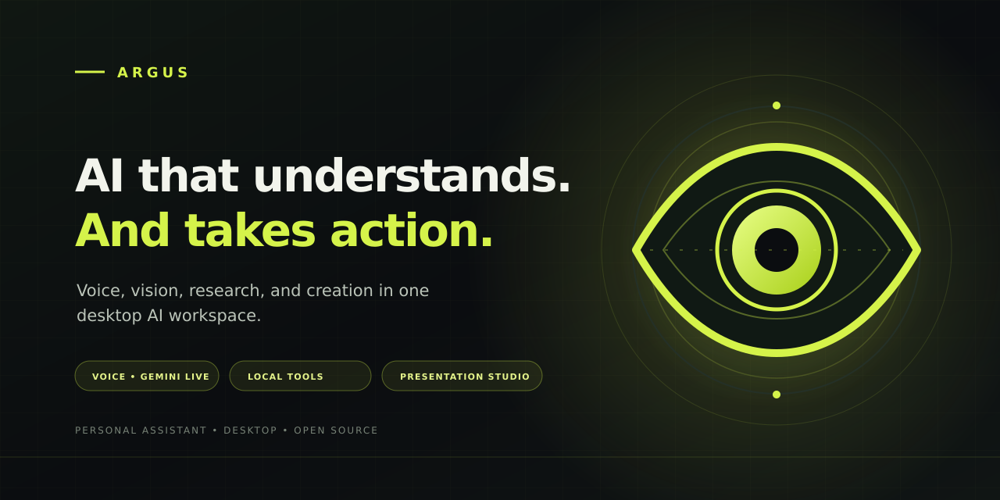

<div align="center">
  <a href="README.md"><strong>English</strong></a> · <a href="README.pt-BR.md">Português (Brasil)</a>
  <br><br>
  
  <br>
  <a href="https://github.com/anonymandk/Argus/releases">Explore releases</a>
  · <a href="#install-from-source">Install from source</a>
  · <a href="#documentation">Documentation</a>
  <p><strong>Version 0.1.0 · pre-release</strong></p>
</div>

**Argus is your personal AI assistant for desktop.** Talk naturally, research,
work with files, and turn source material into editable presentations—all from
one workspace.

Argus brings Gemini Live together with optional local tools, helping you move
from an idea to a finished task while keeping computer actions under your
control.

## What you can do

- **Talk naturally:** use Gemini Live voice conversations or send instructions
  by text.
- **Work with context:** research the web and use files, screen context, and
  browser tools when you enable the required permissions.
- **Create presentations:** build and edit widescreen `.pptx` decks from
  documents, data, images, audio, and video, with optional PDF export.
- **Choose how to run it:** use the desktop app and its local tools, or explore
  the FastAPI service with its Next.js web client.

Optional integrations depend on your credentials, system permissions, and
installed applications. Gemini Live requires a Google API key; quotas and any
charges depend on your Google account.

## Get started

### Releases

The release workflow builds installers for Windows, macOS, and Linux and
publishes SHA-256 checksums. **Version 0.1.0 installers have not been published
yet.** Visit the [Argus releases page](https://github.com/anonymandk/Argus/releases)
for the first binary release, or install from source now:

### Install from source

Python 3.11 or newer is required.

```bash
git clone https://github.com/anonymandk/Argus.git Argus
cd Argus
python scripts/setup_argus.py
```

On Windows, you can also run `scripts/setup_argus.bat`. After setup, add your
`GEMINI_API_KEY` to `.env` and start Argus:

```bash
argus
```

The core app runs on Windows, macOS, and Linux. Individual integrations depend
on each system's available applications and permissions.

## Run the web service locally

The repository also includes a multi-user FastAPI service and a Next.js web
client. Start the local stack with Docker:

```bash
docker compose up --build
```

Then open `http://localhost:3000`. See the [usage guide](docs/USAGE.md) for API,
web client, and deployment configuration. Deployment templates are provided;
they do not mean that a public hosted service is currently available.

## Privacy and security

The desktop app uses local storage on your computer. The web service supports
configurable retention, defaulting to 90 days for chat messages, task history,
and answer cache records. **The audited code contains no product telemetry.**
Read the [privacy policy](PRIVACY.md), [terms of use](TERMS.md), and
[security policy](SECURITY.md). The legal documents are templates and need
professional review before commercial use.

## Project status

- **Release:** SemVer `0.1.0`, changelog, and installer workflow are configured.
  Binaries require publishing the tag and completing CI.
- **Desktop:** a 60-second idle sample on CachyOS Linux measured 17.236% average
  CPU use of one logical core and 172.859 MiB average RSS. Typical and intense
  scenarios, and official hardware requirements, have not been measured. See
  the [benchmark report and raw data](docs/benchmarks/desktop.md).
- **Web API:** a local SQLite test reached 40 concurrent sessions without
  observed saturation; the maximum was not determined. Docker Compose and
  production resource limits have not been measured. See the
  [load report](docs/benchmarks/web.md).

These results describe only the tested environments and are not a performance
guarantee for other hardware or configurations.

## Documentation

- [Usage guide](docs/USAGE.md)
- [Tutorial](docs/TUTORIAL.md)
- [Changelog](CHANGELOG.md)
- [QA and audit guide](docs/QA.md)
- [Contributing](CONTRIBUTING.md)
- [Privacy](PRIVACY.md) · [Terms](TERMS.md) · [Security](SECURITY.md)

## Brand assets

- [Vector logo (SVG)](assets/branding/argus-mark.svg)
- [GitHub avatar (PNG, 1024 × 1024)](assets/branding/argus-github-avatar.png)
- [English GitHub social image (PNG, 1280 × 640)](assets/branding/argus-github-banner-en.png)
- [English social image vector source](assets/branding/argus-github-banner-en.svg)

## License

MIT — see [LICENSE](LICENSE).

---

**Language:** **English** · [Português (Brasil)](README.pt-BR.md)
