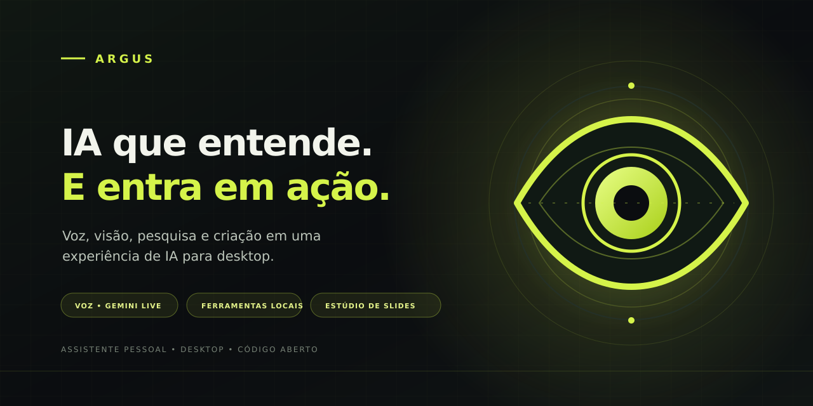

<div align="center">
  
  <br>
  <a href="https://github.com/anonymandk/Argus/releases">Ver releases</a>
  · <a href="#instalar-do-código-fonte">Instalar pelo código-fonte</a>
  · <a href="#documentação">Documentação</a>
  <p><strong>Versão 0.1.0 · pré-lançamento</strong></p>
</div>

**Argus é seu assistente pessoal de IA para desktop.** Converse por voz ou
texto, pesquise, trabalhe com arquivos e transforme materiais em apresentações
editáveis — em um só espaço de trabalho.

Ele combina Gemini Live com ferramentas locais opcionais para ajudar você a
sair da intenção e chegar ao resultado, mantendo as ações do computador sob seu
controle.

## O que você pode fazer

- **Conversar naturalmente:** use voz com Gemini Live ou envie instruções por
  texto.
- **Pesquisar e trabalhar com contexto:** encontre informações e use arquivos,
  tela e navegador conforme as permissões que você habilitar.
- **Criar apresentações:** monte e edite apresentações widescreen `.pptx` a
  partir de documentos, dados, imagens, áudio e vídeo, com exportação opcional
  para PDF.
- **Escolher como executar:** use o aplicativo desktop e suas ferramentas
  locais ou explore o serviço web FastAPI com cliente Next.js.

As integrações opcionais dependem de credenciais, permissões do sistema e
aplicativos instalados. O uso do Gemini requer uma chave de API Google; cotas e
eventuais cobranças seguem as condições da sua conta Google.

## Começar

### Releases

O workflow de release prepara instaladores para Windows, macOS e Linux com
checksums SHA-256. **Os instaladores da versão 0.1.0 ainda não foram
publicados.** Acesse a [página de releases](https://github.com/anonymandk/Argus/releases)
para acompanhar a primeira publicação. A instalação pelo código-fonte já está
disponível:

### Instalar do código-fonte

Requer Python 3.11 ou mais recente.

```bash
git clone https://github.com/anonymandk/Argus.git Argus
cd Argus
python scripts/setup_argus.py
```

No Windows, você também pode iniciar `scripts/setup_argus.bat`. Depois da
instalação, adicione sua chave `GEMINI_API_KEY` ao arquivo `.env` e execute:

```bash
argus
```

O núcleo do Argus funciona em Windows, macOS e Linux. Algumas integrações
dependem dos recursos e permissões disponíveis em cada sistema.

## Serviço web local

O repositório também inclui uma API FastAPI multiusuário e uma interface Next.js.
Para subir o conjunto local com Docker:

```bash
docker compose up --build
```

Depois, abra `http://localhost:3000`. Consulte o [guia de uso](docs/USAGE.md)
para configuração da API, do cliente web e dos modelos de deploy. A presença
dos templates de deploy não significa que exista um serviço hospedado público.

## Privacidade e segurança

No modo desktop, o Argus usa os armazenamentos locais da máquina. O serviço web
suporta retenção configurável de 90 dias, por padrão, para mensagens de chat,
histórico de tarefas e cache de respostas. **Não há telemetria de produto** no
código auditado. Leia a [política de privacidade](PRIVACY.md), os
[termos de uso](TERMS.md) e as [instruções de segurança](SECURITY.md). Os
documentos jurídicos são modelos e precisam de revisão profissional antes de
uso comercial.

## Estado do projeto

- **Release:** SemVer `0.1.0`, changelog e workflow configurados; binários
  dependem da publicação da tag e da conclusão do CI.
- **Desktop:** foi medida uma execução ociosa de 60 segundos em Linux CachyOS,
  com CPU média de 17,236% de um núcleo lógico e RSS médio de 172,859 MiB. Os
  cenários de uso típico/intenso e os requisitos oficiais ainda não foram
  medidos. Veja o [relatório e os dados brutos](docs/benchmarks/desktop.md).
- **API web:** o teste local com SQLite chegou a 40 sessões sem saturação
  observada; o máximo não foi determinado. O deploy Docker Compose e os limites
  de produção ainda não foram medidos. Veja o [relatório de carga](docs/benchmarks/web.md).

Esses resultados descrevem apenas os ambientes testados; não são uma garantia
de desempenho em outro hardware ou configuração.

## Documentação

- [Guia de uso](docs/USAGE.md)
- [Tutorial](docs/TUTORIAL.md)
- [Histórico de versões](CHANGELOG.md)
- [QA e auditoria](docs/QA.md)
- [Contribuição](CONTRIBUTING.md)
- [Privacidade](PRIVACY.md) · [Termos](TERMS.md) · [Segurança](SECURITY.md)

## Identidade visual

- [Logo vetorial (SVG)](assets/branding/argus-mark.svg)
- [Avatar GitHub (PNG, 1024 × 1024)](assets/branding/argus-github-avatar.png)
- [Imagem social GitHub (PNG, 1280 × 640)](assets/branding/argus-github-banner.png)
- [Fonte vetorial da imagem social](assets/branding/argus-github-banner.svg)

## Licença

MIT — consulte [LICENSE](LICENSE).
